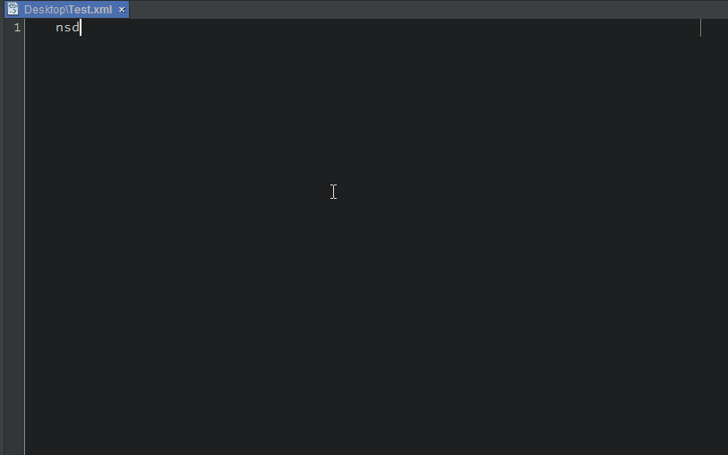

<h1>NativeScript Snippets for NetBeans</h1>
This extension for NetBeans adds snippets for NativeScript Tags in XML files.

It is based on the Visual Studio Code implementation: <a href="https://marketplace.visualstudio.com/items?itemName=wwwalkerrun.nativescript-ng2-snippets">NativeScript + Angular 2 Snippets for VS Code</a>

<h3>XML</h3>

<h2>Usage</h2>
Type part of a snippet, press <strong>enter</strong> or <strong>tab</strong>, and the snippet unfolds.

<h3>UI Components</h3>

<h3>Layouts</h3>
<ol>
    <li><strong>nsabsolute</strong> - Absolute Layout</li>
    <li><strong>nsdock</strong> - Dock Layout</li>
    <li><strong>nsgrid</strong> - Grid Layout</li>
    <li><strong>nsgrid_2x2</strong> - Grid Layout 2x2</li>
    <li><strong>nsgrid_2x2_auto</strong> - Grid Layout 2x2 Automatic Width/Height</li>
    <li><strong>nsgrid_3x3_auto</strong> - Grid Layout 3x3 Automatic Width/Height</li>
    <li><strong>nsgrid_4x3_auto</strong> - Grid Layout 4x3 Automatic Width/Height</li>
    <li><strong>nsgrid_4x4_auto</strong> - Grid Layout 4x4 Automatic Width/Height</li>
    <li><strong>nsgrid_3x3</strong> - Grid Layout 3x3</li>
    <li><strong>nsgrid_4x3</strong> - Grid Layout 4x3</li>
    <li><strong>nsgrid_4x4</strong> - Grid Layout 4x4</li>
    <li><strong>nsstack</strong> - Stack Layout</li>
    <li><strong>nsstack_horizontal</strong> - Stack Layout Horizontal</li>
    <li><strong>nswrap</strong> - Wrap Layout</li>
</ol>

<h3>Widgets</h3>
<ol>
    <li><strong>nsactionbar</strong> - Action Bar</li>
    <li><strong>nsactionbarcustomtitle</strong> - Action Bar with Custom Title</li>
    <li><strong>nsactionbarback</strong> - Action Bar with Back Button</li>
    <li><strong>nslabel</strong> - Label</li>
    <li><strong>nstextfield</strong> - Text Field</li>
    <li><strong>nspassword</strong> - Secure Text Field (for passwords)</li>
    <li><strong>nstextview_editable</strong> - Text View (editable)</li>
    <li><strong>nstextview_non-editable</strong> - Text View (non editable)</li>
    <li><strong>nsimg</strong> - Image</li>
    <li><strong>nsborder</strong> - Border</li>
    <li><strong>nsbtn</strong> - Button</li>
    <li><strong>nssearchbar</strong> - Search Bar</li>
    <li><strong>nsswitch</strong> - Switch</li>
    <li><strong>nsslider</strong> - Slider</li>
    <li><strong>nsprogress</strong> - Progress</li>
    <li><strong>nsloading</strong> - Activity Indicator</li>
    <li><strong>nsdate</strong> - Date Picker</li>
    <li><strong>nstime</strong> - Time Picker</li>
    <li><strong>nslistpicker</strong> - List Picker</li>
    <li><strong>nssegmentedbar</strong> - Segmented Bar</li>
    <li><strong>nstabview</strong> - Tab View</li>
    <li><strong>nslistview</strong> - List View</li>
    <li><strong>nswebview</strong> - Web View</li>
    <li><strong>nsscrollview</strong> - Scroll View</li>
</ol>

<h2>How to install</h2>

Install the plugin.

Test it into a XML file (Examples: shortcut <strong>ngtime</strong> + TAB => &lt;TimePicker [hour]="... )

  
<h2>Known Bugs</h2>
XML code completion doesn't include the code templates, but the code templates are working well. I created a ticket for this.